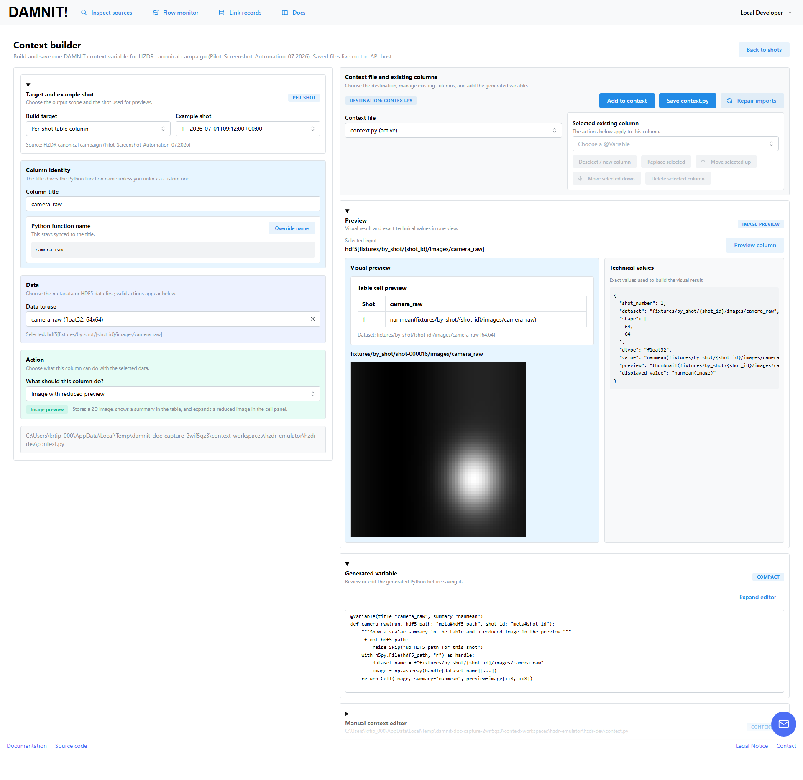

# Screenshots

All six images are generated from a disposable local fixture stack at a
1920×1080 viewport:

Install frontend dependencies first with `pnpm --dir frontend install --frozen-lockfile`
using Node 24 or newer and the pinned pnpm version. The capture keeps a compatible
Node already on PATH; otherwise it uses the newest installed nvm release matching
the major version in `.nvmrc` (under `NVM_DIR` or `~/.nvm`). This also works from
PowerShell without loading nvm in a profile. It does not install Node or change
your shell configuration.

```powershell
uv run playwright install chromium  # one-time
uv run python hzdr/scripts/capture-screenshots.py
```

The command creates the fixture campaigns, runs the real package emulator,
FastAPI service, and Vite frontend on ephemeral localhost ports, drives every
page below, writes `screenshots/capture-receipt.json`, and stops the processes.
It requires no broker, MongoDB, credentials, or production service.
Server output and browser errors are printed to the terminal for troubleshooting.

## What the fixture stack contains

The capture script authors the whole campaign itself, so the pages show a run
rather than a single shot:

- **Two emulated sources.** `Pilot_Screenshot_Automation_07.2026` fires 16 shots
  across two days; `Target_Alignment_Checks_06.2026` adds a shorter 6-shot day.
  Both are normal `hzdr-event-v1` packages fed through
  `api/scripts/hzdr-package-emulator.py`.
- **Five events per shot** from the three Kafka-pilot producers — a Shotcounter
  notice, a LaserData energy reading, a LaserData waveform, and two DAQ File
  Watchdog events from two different watcher computers. That is what fills the
  producer-status view and the context-builder's dataset picker.
- **A seeded `context.py` workspace** whose four variables cover the cell kinds
  DAMNIT-web renders: a camera-frame thumbnail, a per-shot lineout sparkline, a
  numeric column with its campaign trend, and a plain label.
- **A curated LabFrog snapshot** per campaign, in the `shot_summary` shape
  labfrog-sqlite-tools exports, so Link records has something to cross-reference.

Everything lives in a temporary directory and is deleted when the capture ends.
The values are synthetic: they are shaped like a DRACO run, but no shot in them
was ever fired.

## Home — source workspace

The landing page (`/home`): entry points to the flow monitor, shot table,
and docs, plus the sources visible to the HZDR provider.


## Shot table

A source page (`/source/{source_key}`): the per-shot table with status
badges, campaign/context columns, inline image and trend previews, and the
selected-cell / shot-sets side panel. The capture clicks a camera-image cell,
so the panel shows the full preview and that column's trend across the run.


## Context builder

`/source/{source_key}/context-builder`: building one context column from a
per-shot HDF5 dataset — pick the data, pick what the column should do, and see
the rendered cell, the exact values behind it, and the Python that will be
appended to `context.py`.



## Link existing shot records

`/link-shot-records`: pick a curated LabFrog campaign, cross-reference
Shotcounter/Watchdog/shotsheet records, and build a review package. Shown
with a campaign and source selected, so the curated reference, producer
status, and built draft are all populated. MediaWiki and SciCat stay
unconfigured — the capture talks to no external service.


## In-app docs

`/docs`: the produce → stage → inspect workflow summary with the
quick-start commands, captured with every section expanded.


## Flow monitor

`/flow-monitor`: the live system diagram from producers (Shotcounter,
LaserData, DAQ File Watchdog, MongoDB shotsheet) through Kafka/ASAPO into
the staged event log, the HDF5 builder, and the DAMNIT-web live view.
Demo mode emulates producer events locally; Live mode reads real
broker/spool activity. The capture runs one shot through the demo buttons,
which is what fills the traffic log — and why this page is photographed last,
after every page that shows the untouched campaign.


